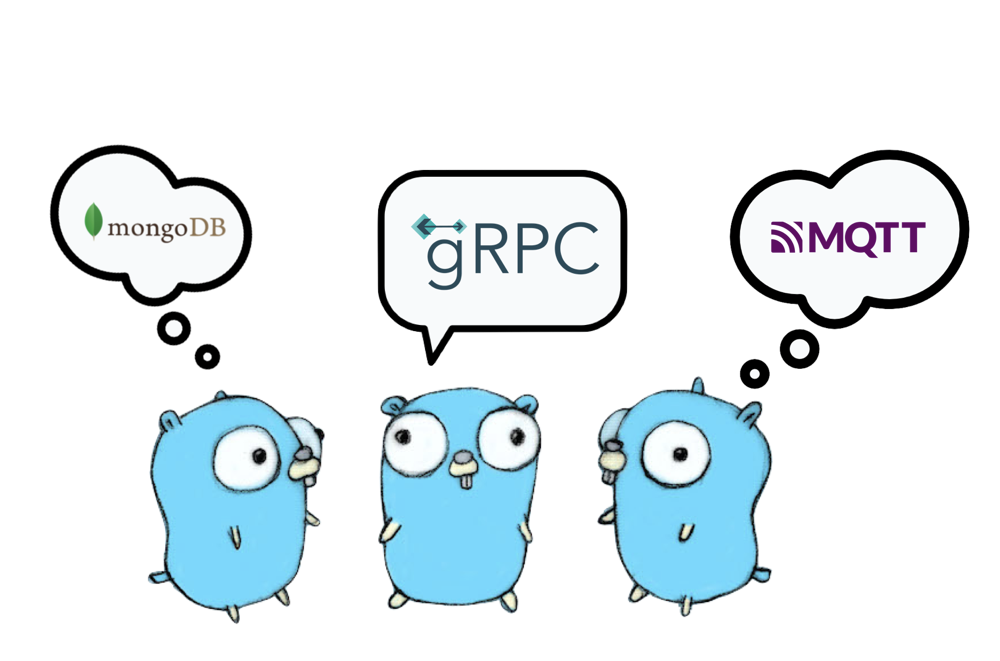

# vitalsign-publisher
The Vitalsign Publisher project is a Golang application that collects and publishes vital sign data from patients to an MQTT broker. The serving rpn(nurse) list is modified by jack-api via gRPC. It gets all patients information belongs to the nurse by api, retrieves relevant data from a MongoDB database, and packages the data into a specific format before publishing it to the MQTT broker.

## Working flow

1. Loop through the rpn list to serve all rpn(nurse)
2. Get patients info under the rpn via api request 
3. Only patient.status == 4 can go ahead (status=4 means patient is uploading data)
4. Retrieves vital sign data from mongoDB.ecg.rt_vital_sign.
5. Retrieves ECG (electrocardiogram) and blood pressure data from mongoDB.ecg.ecgdata12 and mongoDB.ecg.bp
6. Retrieves other vitalsign (HR, CO, VO2) from mongo, too.
7. Packages the collected data into a specific format for publishing.
8. Publish data to two MQTT broker (For APP and Web)

## Prerequisites
Before running the application, ensure you have the following:<br>

- Golang installed on your system.
- Access to an MQTT broker.
- Configuration file (config.yaml) with the necessary settings for API, MongoDB, MQTT, and other parameters.

## Installation
Clone the project repository to your local machine.<br>
Install the required dependencies by running the command.<br>
```
go build
```
This command will install dependencies of the project and compile a executable file named vitalsign-publisher

## Configuration
Before running the application, make sure to configure the necessary settings in the config.yaml file. This includes the API host and port, MongoDB connection details, MQTT broker details, and other specific parameters such as sleep time.

## Usage
To start the Vitalsign Publisher application, run the command
```shell
./vitalsign-publisher
```
The application will begin collecting patient data, packaging it, and publishing it to the configured MQTT broker at regular intervals.